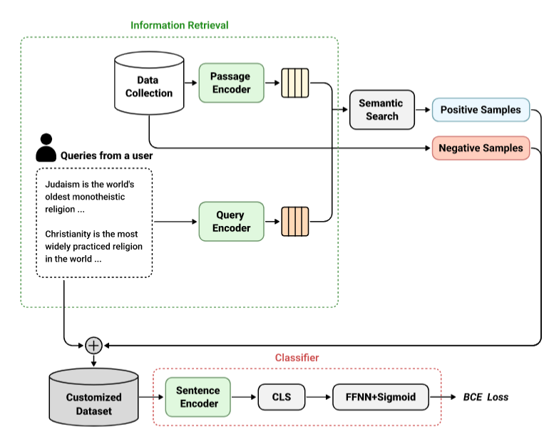

# User-defined Content Detection Framework	


This is the official repository for our [User-defined Content Detection Framework](https://internlp.github.io/2022/documents/2022/papers/8.pdf), accepted on [NeurIPS 2022 Workshopt of InterNLP(Interactive Learning For Natural Langugage Processing)](https://internlp.github.io/2022/accepted_papers.html). 
We introdue a novel research topic, 'user-defined content detection' and propose **UCDF** to solve the task.
UCDF is a set of framework to detect any kind of content that users have defined.

If you want to reproduce this work, you should install dependencies based on  https://github.com/facebookresearch/DPR(*DPR repo*) and additional libraries follow requirements.txt. 
<p align="center">
  
</p>   


## Content
While generating embeddings for Data Collection and training a dual-encoder, we used SimCSE as an encoder not BERT in order to better understand the contexts in sentences. We trained a daul-encoder with NaturalQuestion dataset on contrastive learning. We used source code from *DPR repo* for this process. 
```sh
# generate embeddings for Data Collection
# use train_dense_encoder.py
bash generated_DE.sh

# training a dual-encoder which conducts retrieving process
# use generate_dense_embeddings.py
bash train_encoder.sh
```


Next step, we need to conduct __Information Retrieval__ we should make Customized dataset using Semantic Search algorithm.
```sh
# generate Customized dataset
python build_dataset.py
```


